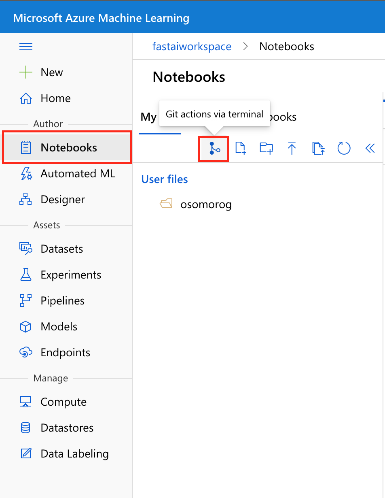

# Use FastAI with Azure Machine Learning!
This repository has examples showing you how to use FastAI on Azure ML.

# Create an ML workspace
The [Azure Machine Learning workspace](https://docs.microsoft.com/en-us/azure/machine-learning/overview-what-is-machine-learning-studio) is the top-level resource for the service. It provides you with a centralized place to work with all the artifacts you create. 

You can create an ML workspace by clicking here - **specify a unique resource group name for your Azure subscription!**:

[](https://portal.azure.com/#create/Microsoft.Template/uri/https%3A%2F%2Fraw.githubusercontent.com%2FAzure%2FAzureML-fastai%2Fmain%2F.cloud%2Fazuredeploy.json)

# Setup FastAI Environment
1) Go to the Azure ML studio (https://ml.azure.com) and find your ML workspace.

2) Open the terminal window in Azure ML studio:



3) Use the terminal window to create a new environment. For example, the code below creates fastaienv and activate the environment:
> **PRO-TIP: Copy and Paste in Terminal**
> * Windows: `Ctrl-c` to copy is supported but use `Shift-insert` to paste.
> * FireFox/IE may not support clipboard permissions properly.
> *    Mac OS: `Cmd-c` to copy and `Cmd-v` to paste.

```shell
echo "y" | conda create --name fastaienv
conda activate fastaienv
```

4) Install fastai, nbdev, pip and ipykernel package to the new environment and create a kernel for that conda env:
```shell
echo "y" | conda install pip
echo "y" | conda install ipykernel
echo "y" | conda install -c fastai -c pytorch fastai
echo "y" | conda install -c fastai nbdev
```
If you don't already have fastai, then you have to wait for the libraries and dependencies to install. Wait up to 10 mins for this to complete and continue to the next step.

5) Create a kernel for that conda env:
```shell
python -m ipykernel install --user --name fastaienv --display-name "Python (fastaienv)"
```

6) Clone the [Fast AI Repo](https://github.com/fastai/fastai) with below snippet:
```shell
git clone https://github.com/fastai/fastai.git
```

All of the notebook samples should now be cloned into the fastai folder and ready to run!

7) Refresh File Explorer to see all new files.


# Running FastAI Notebooks
1) Open a notebook in `fastai/nbs` you just cloned:


2) Always make sure you select the `Python (fastaienv)` Kernel:


3) Run all cells in Notebook:


# Shutting down your compute
When you're down make sure you **stop your compute**! If you don't you'll keep getting charged until you click the stop compute button.


# Returning back to work
When you want to go back to your notebook exercises, just find the notebook in the AzureML Studio and hit **Play** on any cell.

It will take a few mins to reboot your compute and run you cell. Make sure you have selected the `Python (fastaienv)` kernel when you notebook is running.

# Contributing

This project welcomes contributions and suggestions.  Most contributions require you to agree to a
Contributor License Agreement (CLA) declaring that you have the right to, and actually do, grant us
the rights to use your contribution. For details, visit https://cla.opensource.microsoft.com.

When you submit a pull request, a CLA bot will automatically determine whether you need to provide
a CLA and decorate the PR appropriately (e.g., status check, comment). Simply follow the instructions
provided by the bot. You will only need to do this once across all repos using our CLA.

This project has adopted the [Microsoft Open Source Code of Conduct](https://opensource.microsoft.com/codeofconduct/).
For more information see the [Code of Conduct FAQ](https://opensource.microsoft.com/codeofconduct/faq/) or
contact [opencode@microsoft.com](mailto:opencode@microsoft.com) with any additional questions or comments.
